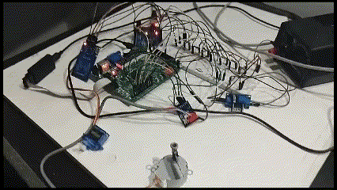

<h1 align="center">Carrusel Vertical - Electrónica Digital I</h1>

    

 Electrónica Digital I 

    <a href="https://www.instagram.com/esteban_625/"><strong>Jhoan Esteban Castañeda</strong></a>
    ·
    <a href="https://www.instagram.com/maicoltunjano13/"><strong>Maicol David Tunjano </strong></a>
    ·
    <a href="https://www.instagram.com/sebaspantojaf/"><strong>Sebastian A. Pantoja F.</strong></a>
    ·
    <a href="https://www.instagram.com/jj_cotes/"><strong>José J. Cotes A.</strong></a> <!--https://github.com/jjCotes/-->

<h2 align="center">Alcance y Problemática</h2>

 
    En la Universidad Nacional de Colombia sede Bogotá, un gran porcentaje de personas (estudiantes, docentes, personal, etc.) utilizan vehículos personales como medio de transporte diario para poder dirigirse a las instalaciones. A su vez, un gran porcentaje de estas personas son propietarias de motocicletas. Dentro del mundo del motociclismo, el casco se convierte en una molestia cuando se llega al destino y no hay un lugar seguro para guardarlo. Frecuentemente los propietarios optan por llevar sus cascos con ellos o encuentran la manera de fijarlos a las mismas motocicletas. Además de ser incámodo tener que llevar “colgado” el casco a todo lugar, existe la posibilidad de pérdida del objeto por olvido. La alternativa de dejar ligado el casco a la motocicleta puede no resultar del todo exitosa puesto a que, considerando que en el campus los parqueaderos están al aire libre, los cascos quedan expuestos no solo a personas malintencionadas sino también a daños generados por lluvias o climas muy cálidos.

<h2 align="center">Montaje, Ensayos y Pruebas</h2>

    

<h2 align="center">Referencias</h2>

- <a href="https://www.mecalux.com.co/manual-almacenaje/sistemas-de-almacenaje/almacen-%20vertical-carrusel-horizontal"><strong>Almacenes verticales y carruseles verticales u horizontales</strong></a>
- <a href="https://zonalogistica.com/el-sistema-de-almacenamiento-vertical-carruseles-verticales/"><strong>El sistema de almacenamiento vertical (Carruseles verticales)</strong></a>
- <a href="https://ingenieria.capris.com.co/kardex-2/"><strong>Kardex - Capris Colombia | Ingeniería</strong></a>
- <a href="https://arquitecturayempresa.es/noticia/eco-cycle-arquitectura-urbana-subterranea-por-la-sostenibilidad"><strong>ECO Cycle. Arquitectura urbana subterránea por la sostenibilidad</strong></a>
- <a href="http://planeacion.unal.edu.co/menu-principal/sistema-de-planeacion/gestion-por-proyectos/"><strong>Gestión por Proyectos - Sistema de Planeación UNAL</strong></a>
- <a href="https://www.amazon.com/Electronic-Devices-Thomas-L-Floyd/dp/1292222999">Electronic Devices [10th Edición] - Thomas L. Floyd<strong></strong></a>

