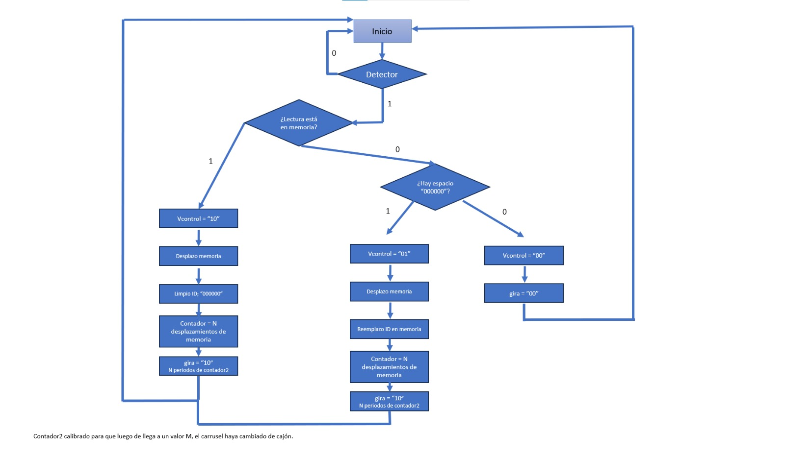

<h1 align="center">Carrusel Vertical</h1>

    

 Electrónica Digital I 

    <a href="https://www.instagram.com/esteban_625/"><strong>Jhoan Esteban Castañeda</strong></a>
    ·
    <a href="https://www.instagram.com/maicoltunjano13/"><strong>Maicol David Tunjano </strong></a>
    ·
    <a href="https://www.instagram.com/sebaspantojaf/"><strong>Sebastian A. Pantoja F.</strong></a>
    ·
    <a href="https://www.instagram.com/jj_cotes/"><strong>José J. Cotes A.</strong></a> <!--https://github.com/jjCotes/-->

<h2 align="center">Descripción</h2>

 
    El proyecto consiste en un locker de cascos de motocicleta automatizado que cuenta con 2 periféricos de entrada y 2 de salida. Como periféricos de entrada se tiene principalmente un lector RFID que tiene la función de leer la identificación del usuario para posteriormente guardarla y asignarle un casillero vacío. Como segundo periférico de entrada se emplea un sensor de proximidad con el objetivo de detectar si un casillero se encuentra vacío. Cuando el lector RFID detecta una tarjeta, se activa un motor paso a paso el cual se encarga de girar una cadena que a su vez mueve los casilleros de tal forma que el sensor de proximidad (que está fijo en la estructura del locker) pueda detectar si el casillero está vacío o no. Si se determina que el casillero está vacío, se activa un segundo periférico de salida que consiste en un servo-motor que libera la puerta del casillero a utilizar.

<h2 align="center">Problema a resolver</h2>

 
    En la Universidad Nacional de Colombia sede Bogotá, un gran porcentaje de personas (estudiantes, docentes, personal, etc.) utilizan vehículos personales como medio de transporte diario para poder dirigirse a las instalaciones. A su vez, un gran porcentaje de estas personas son propietarias de motocicletas. 

 
    Dentro del mundo del motociclismo, el casco se convierte en una molestia cuando se llega al destino y no hay un lugar seguro para guardarlo. Frecuentemente los propietarios optan por llevar sus cascos con ellos o encuentran la manera de fijarlos a las mismas motocicletas. Además de ser incómodo tener que llevar “colgado” el casco a todo lugar, existe la posibilidad de pérdida del objeto por olvido. La alternativa de dejar ligado el casco a la motocicleta puede no resultar del todo exitosa puesto a que, considerando que en el campus los parqueaderos están al aire libre, los cascos quedan expuestos no solo a personas malintencionadas sino también a daños generados por lluvias o climas muy cálidos.

<h2 align="center">Solución</h2>

    La solución propuesta para el proyecto es usar carruseles verticales subterráneos con la capacidad de controlarse mediante el uso del carné estudiantil. Así pues, el estudiante acerca su carné al lector, y el carrusel girará y buscará un espacio. Luego de encontrar un espacio, abrirá la puerta de seguridad y el estudiante podrá depositar su casco. Con esto, el estudiante debe cerrar la puerta de seguridad y su casco quedara guardado. Cuando el estudiante desee recoger su casco, acercará su carné al lector y el carrusel girará y buscará el espacio asociado a ese carné. Finalmente abrirá la puerta de seguridad y el estudiante podrá recuperar su casco.

    

<h2 align="center">Político</h2>

    Aunque el proyecto inicialmente se implementaría dentro de la Universidad Nacional de Colombia, si se quisieran desarrollar modelos en cualquier parte de la ciudad existen ciertas restricciones que deben considerarse antes de su instalación. La ley 1801 de 2016 entre otras cosas, prohíbe la obstrucción del espacio público y establece sanciones para quienes invadan de cualquier manera el sendero peatonal. Por otra parte, el artículo 94 de la ley 760 de 2002 del código nacional de tránsito establece que los conductores y los acompañantes, deberán utilizar casco de seguridad al momento de transitar en motocicleta. Con esto se esperaría que todo motociclista que ingrese al campus porte un casco de seguridad haciendo que el proyecto sea útil y llamativo para los actores a los cuales va dirigido.

<h2 align="center">Económico</h2>

    Nuestro proyecto sigue la corriente de convertir el campus en un lugar cómodo y acogedor por lo que el uso de los casilleros no tendría ningún costo para el consumidor. Aunque esto significa una ventaja económica para el usuario, para nosotros como desarrolladores no generaría ningún tipo de ganancia o cobertura para enfrentar los mantenimientos, gastos y/o reparaciones a daños que puedan surgir.

<h2 align="center">Social</h2>

    Teniendo en cuenta las sanciones que genera el no portar un casco de seguridad al momento de conducir una motocicleta y que los ´ındices de inseguridad y hurto a personas han venido incrementando desde el a˜no pasado (figura 11 ), es imprescindible que las personas comiencen a ser precavidas en el cuidado de sus pertenencias y, particularmente en el caso de los motociclistas, sus cascos de seguridad. Esta situaci´on permite que nuestro proyecto tenga una buena acogida dentro del campus.

<h2 align="center">Tecnológico</h2>

    Actualmente existen casilleros con distintos servicios que se enfocan en la comodidad del usuario como iluminación, ventilación e incluso acceso con datos biométricos. Inicialmente nuestros casilleros no implementarían ninguna de estas funciones debido a un incremento considerable en el presupuesto para su desarrollo. Aunque debido a estas tecnologías nuestro proyecto puede verse un poco anticuado, son características que se piensan implementar a largo plazo.

<h2 align="center">Legal</h2>

- <h4>Para el proyecto dentro de la Universidad</h4>

    El desarrollo institucional en la Universidad Nacional de Colombia se materializa a través de la gestión de proyectos de inversión y soporte institucional.

    La normatividad de la gestión por proyectos de inversión y soporte institucional en la Universidad Nacional de Colombia esta dada en el Acuerdo 238 de 2017 del Consejo Superior Universitario y la Resolución 355 de 2022 de la Rectoría. Donde se encuentran los lineamientos para los procedimientos de los proyectos de inversión.

    Con la resolución de Rectoría No. 418 del 24 de abril del 2000, se organizó el Banco de Proyectos de la Universidad Nacional de Colombia, como un sistema de información en red administrado por la Oficina Nacional de Planeación.

    Banco de Proyectos de la Universidad Nacional - BPUN. Es un aplicativo que vincula la planeación con el registro de la formulación, la ejecución, el seguimiento, la evaluación final y cierre de los programas y proyectos de inversión de gestión y soporte institucional, seleccionados como viables y previamente evaluados técnica, económica y socialmente.

    La Resolución de Rectoría 309 de 09 de marzo de 2009, indica que la Oficina Nacional de Planeaciín, es la responsable de la administración del Banco de Proyectos de la Universidad Nacional de Colombia y se definieron los lineamientos para los procedimientos del Banco de Proyectos de la Universidad Nacional de Colombia.

    La Resolución de Rectoría 383 de 2014 se establece la estructura interna de la Dirección Nacional de Planeación y Estadística, y se determinan sus funciones, entre las cuales se encuentra la coordinación del Sistema de Planeación de la Universidad.

    Acuerdo 238 DE 2017 Capitulo V del plan de acción institucional, de los planes de acción de sede y del banco de proyectos de la Universidad Nacional de Colombia – BPUN.

- <h4>Para el uso del subsuelo necesario para el proyecto</h4>

    Plan de Ordenamiento Territorial de Bogotá D.C, Decreto 555 de 2021, Artículo 145. Intervención y Ocupación del Espacio Público.

    Instituto de Desarrollo Urbano - Autorizar la utilización del espacio aéreo o del subsuelo para generar elementos de enlace urbano entre inmuebles privados, o entre inmuebles privados y elementos del espacio público.

<h2 align="center">Diagrama de Flujo</h2>

    

<h2 align="center">Diagramas de Bloques</h2>

    

  

    

<h2 align="center">Máquinas de Estado</h2>

    

  

    

    

<h2 align="center">Simulaciones</h2>

    

 

    

 

<h2 align="center">Montaje, Ensayos y Pruebas</h2>

- <h4>Idea inicial</h4>

    

 

- <h4>Prueba de funcionamiento sin carga</h4>

https://github.com/jjCotes/Electronica-Digital-I-2023-I/assets/49933067/974ba413-4aed-4c4c-8b41-b446440c104f

[Aquí](https://www.youtube.com/watch?v=nqqfatD8eCk) se muestra un video más detallado del funcionamiento del proyecto.

 

- <h4>Ensamble del motor al eje principal del carrusel</h4>

    

 

- <h4>Estructura de madera</h4>

    

<h2 align="center">Referencias</h2>

- <a href="https://www.amazon.com/Electronic-Devices-Thomas-L-Floyd/dp/1292222999">Electronic Devices [10th Edición] - Thomas L. Floyd<strong></strong></a>
- <a href="https://www.mecalux.com.co/manual-almacenaje/sistemas-de-almacenaje/almacen-%20vertical-carrusel-horizontal"><strong>Almacenes verticales y carruseles verticales u horizontales</strong></a>
- <a href="https://zonalogistica.com/el-sistema-de-almacenamiento-vertical-carruseles-verticales/"><strong>El sistema de almacenamiento vertical (Carruseles verticales)</strong></a>
- <a href="https://ingenieria.capris.com.co/kardex-2/"><strong>Kardex - Capris Colombia | Ingeniería</strong></a>
- <a href="https://arquitecturayempresa.es/noticia/eco-cycle-arquitectura-urbana-subterranea-por-la-sostenibilidad"><strong>ECO Cycle. Arquitectura urbana subterránea por la sostenibilidad</strong></a>
- <a href="http://planeacion.unal.edu.co/menu-principal/sistema-de-planeacion/gestion-por-proyectos/"><strong>Gestión por Proyectos - Sistema de Planeación UNAL</strong></a>

